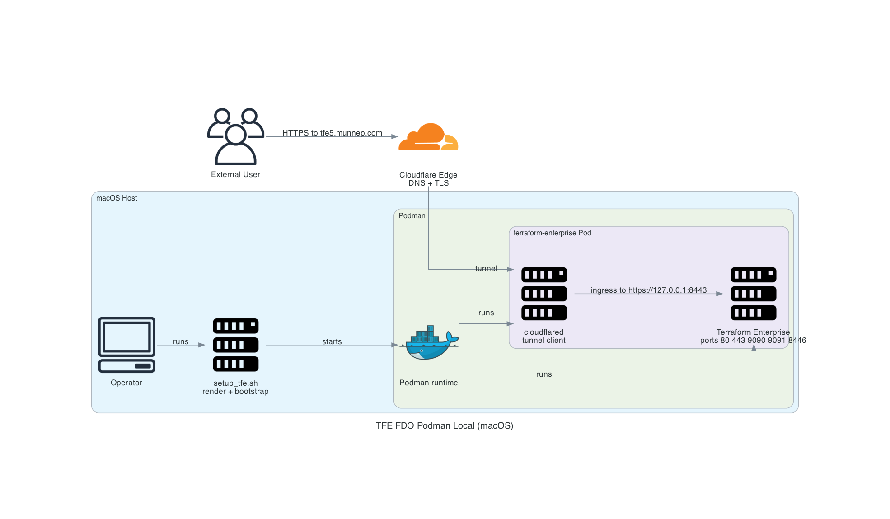

# Terraform Enterprise on Podman with Cloudflare Tunnel

This repository builds a local Terraform Enterprise environment on macOS using Podman and a Cloudflare Tunnel.

The repo automates:

- rendering a Podman pod spec from a template
- generating self-signed TLS assets for Terraform Enterprise
- creating or deleting the Cloudflare tunnel configuration
- starting the Terraform Enterprise and cloudflared containers with `podman kube play`
- optionally bootstrapping the initial admin user and organization

The intended flow is:

1. You provide a hostname, for example `tfe5.munnep.com`.
2. The setup script creates local TLS files for that hostname.
3. The Cloudflare tunnel forwards public HTTPS traffic to the local TFE container.
4. Terraform Enterprise runs locally behind the tunnel.

## Requirements

You need these installed on the macOS host:

- `podman`
- `cloudflared`
- `openssl`
- `curl`
- `jq`

You also need:

- a Cloudflare account with a zone you control
- permission to create Cloudflare tunnels and DNS records for that zone
- a valid Terraform Enterprise license file

## Cloudflare And TFE License

### Cloudflare

This project expects Cloudflare Tunnel to publish the TFE hostname.

The setup flow uses the scripts under `tfe/cloudflared/` to:

- create or update a tunnel
- write `tfe/cloudflared/config.yml`
- store tunnel credentials in `tfe/cloudflared/`
- create the DNS route for the hostname

The current tunnel config forwards traffic to the local Terraform Enterprise container on `https://127.0.0.1:8443`.

### Terraform Enterprise license

You must place the Terraform Enterprise license file at:

```text
license_location/license.pem
```

The setup script checks that file before it starts the stack.

The pod spec exposes that file to Terraform Enterprise through `TFE_LICENSE_PATH`.

## Architecture



High-level components:

- External users access the TFE hostname through Cloudflare.
- Cloudflare forwards traffic through the tunnel to the `cloudflared` container.
- The `cloudflared` container forwards ingress to the local Terraform Enterprise container.
- `setup_tfe.sh` renders `tfe/compose.yaml` and starts the pod with Podman.

## Repository Layout

```text
.
├── setup_tfe.sh
├── license_location/
│   └── license.pem
├── tfe/
│   ├── certs/
│   ├── cloudflared/
│   ├── compose.yaml
│   ├── compose_tfe.template
│   ├── data/
│   ├── tfe_create_organization.json
│   └── tfe_initial_user.json
└── diagram/
	├── diagram_tfe_fdo_podman_local.py
	└── diagram_tfe_fdo_podman_local.png
```

## Getting Started

### 1. Put the license in place

```bash
mkdir -p license_location
cp /path/to/your/license.pem license_location/license.pem
```

### 2. Start the environment

Basic startup:

```bash
./setup_tfe.sh --hostname tfe5.munnep.com
```

Start with a specific Terraform Enterprise version:

```bash
./setup_tfe.sh --hostname tfe5.munnep.com --tfe-version 1.1.0
```

Start and bootstrap the initial admin user and organization:

```bash
./setup_tfe.sh --hostname tfe5.munnep.com --bootstrap
```

Start with a specific Terraform Enterprise version and bootstrap it:

```bash
./setup_tfe.sh --hostname tfe5.munnep.com --tfe-version 1.1.0 --bootstrap
```

Render the pod spec only, without starting Podman:

```bash
./setup_tfe.sh --hostname tfe5.munnep.com --render-only
```

Render and configure everything, but do not start the pod:

```bash
./setup_tfe.sh --hostname tfe5.munnep.com --no-start
```

### 3. Check the running stack

```bash
podman ps
podman logs -f terraform-enterprise-terraform-enterprise
podman logs -f terraform-enterprise-cloudflared
```

### 4. Validate the public endpoint

```bash
openssl s_client -showcerts -servername tfe5.munnep.com -connect tfe5.munnep.com:443
```

## Delete The Environment

Delete the Podman stack, generated certs, and Cloudflare tunnel artifacts:

```bash
./setup_tfe.sh --delete --hostname tfe5.munnep.com
```

If you only want to stop the pod manually:

```bash
podman kube down tfe/compose.yaml
```

## Common Commands

Start or replace the current pod from the generated spec:

```bash
podman kube play --replace tfe/compose.yaml
```

Remove the current pod:

```bash
podman kube down tfe/compose.yaml
```

Follow Terraform Enterprise logs:

```bash
podman logs -f terraform-enterprise-terraform-enterprise
```

Follow cloudflared logs:

```bash
podman logs -f terraform-enterprise-cloudflared
```

## Quick Sheet For compose.yaml Changes

`tfe/compose.yaml` is generated from `tfe/compose_tfe.template` by `setup_tfe.sh`.

That means:

- if a change should survive rerenders, update `tfe/compose_tfe.template`
- if you only want to test something quickly, you can edit `tfe/compose.yaml` directly

### Fast test loop

1. Edit `tfe/compose.yaml`
2. Re-apply it with Podman:

```bash
podman kube play --replace tfe/compose.yaml
```

3. Check the containers and logs:

```bash
podman ps
podman logs -f terraform-enterprise-terraform-enterprise
```

### Persist the change

If the quick change works, move the same update into `tfe/compose_tfe.template` so the next `setup_tfe.sh` run does not overwrite it.

Then rerender or rerun setup:

```bash
./setup_tfe.sh --hostname tfe5.munnep.com --render-only
podman kube play --replace tfe/compose.yaml
```

## Notes

- The TLS files generated in `tfe/certs/` are self-signed for the local origin.
- Cloudflare presents the public certificate to clients, so the origin cert is only for the tunnel-to-origin connection.
- The rendered `tfe/compose.yaml` may be regenerated by the setup script at any time.
- If you change the TFE image version, prefer the `--tfe-version` flag instead of editing the generated file directly.